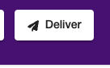

# When to use `Deliver` vs `Invite`

Some users complained that their invitees can't see the button to add a message to a board / card.

## I want to invite people to contribute to a board / card (i.e. sign a card)

Use the 'Invite' button. Use this when you want people to add a message to the board.

## I want to deliver the card / board to the recipient(s)

Use the 'Deliver' button. Use this when you want to deliver the board to the final recipient.

## Can I use 'deliver' button to invite people to contribute?

No, do not do that.

When you use the Deliver button, a link is sent to the recipient, which doesn't allow adding new messages. If you Invite people using the Delivery flow, your invitees will be stuck and won't be able to add any messages.

