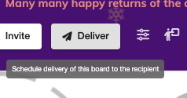
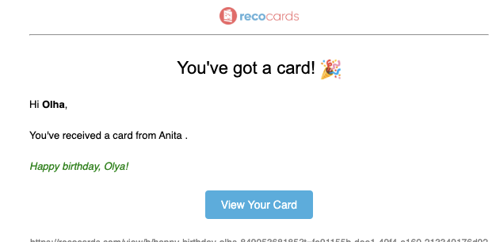

# How to Redeem Gifts?

Only the recipient of a card can redeem gifts, through the unique link sent to their email.

## Step 1 - Deliver the Card

Use the deliver button to deliver the card to the intended recipient.

Cards can only be delivered by the card owners/creators.

## Step 2 - Recipient Receives the Card via email

The email looks something like this:

## Step 3 - Recipient Claims the gift

When the recipient opens the card by clicking "View Your Card" button in their email, or using their unique link, they see an option to claim their gifts on the card.

The `Claim Gifts` button is only visible if there are gifts associated with the card.

## Gift Delivery

Once the recipient claims their gifts, they are delivered within a few days. However, delivery can take 14 more days if additional fraud verification steps are required.

That's it! Happy gifting!